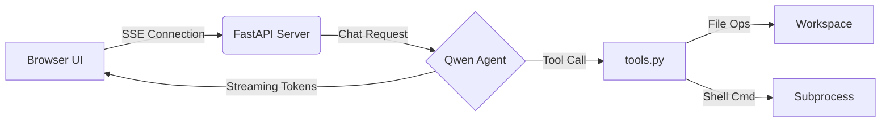

# 🤖 Qwen Local Agent

> **A powerful, self-hosted AI coding assistant that runs entirely on your machine.**  
> Leverage the capabilities of Qwen3.7-Max (or any OpenAI-compatible model) to read, write, edit, and debug code in your local workspace—with full control over every action.


---

## ✨ Features

- **🔒 Privacy-First**: All processing happens locally. Your code never leaves your machine except when calling your configured LLM endpoint.
- **🛠️ Full Toolset**: Read files, write/edit/delete files, list directories, and execute shell commands.
- **✅ Approval Workflow**: Granular control with three permission modes—ask before any state-changing action.
- **💬 Streaming Responses**: Real-time token streaming with Server-Sent Events (SSE) for instant feedback.
- **🧠 Reasoning Support**: Captures and displays chain-of-thought reasoning from models that support it.
- **🖥️ Browser-Based UI**: Clean, responsive interface accessible at `http://127.0.0.1:8765`.
- **⚡ One-Click Launch**: Windows users can start the agent with a double-click via `start.bat`.

---

## 📦 Project Structure

```
qwen-local-agent/
├── server.py           # FastAPI backend & SSE chat endpoint
├── tools.py            # Tool implementations (file ops, commands)
├── static/
│   ├── index.html      # UI entry point
│   ├── app.js          # Frontend logic & streaming client
│   └── style.css       # Styling
├── config.example.json # Configuration template
├── requirements.txt    # Python dependencies
├── start.bat           # Windows launcher script
├── .gitignore          # Git ignore rules
└── README.md           # This file
```

**Generated at runtime:**
- `config.json` – Your personal configuration (API key, model, preferences)
- `sessions.json` – Persistent chat session storage

---

## 🚀 Quick Start

### Prerequisites

| Requirement | Version | Notes |
|-------------|---------|-------|
| Python      | 3.9+    | [Download](https://www.python.org/downloads/) |
| API Key     | —       | From DashScope, OpenRouter, or any OpenAI-compatible provider |
| Internet    | —       | Required to reach your LLM endpoint |

### Installation

#### 1. Clone or Download

```bash
cd /path/to/qwen-local-agent
```

#### 2. Create Virtual Environment

```bash
# Windows
python -m venv venv
venv\Scripts\activate

# macOS / Linux
python3 -m venv venv
source venv/bin/activate
```

#### 3. Install Dependencies

```bash
pip install -r requirements.txt
```

#### 4. Configure

Copy the example config and add your API key:

```bash
cp config.example.json config.json
```

Edit `config.json`:

```json
{
  "api_key": "your-secret-api-key-here",
  "base_url": "https://dashscope-intl.aliyuncs.com/compatible-mode/v1",
  "model": "qwen3.7-max"
}
```

> 🔐 **Security Tip**: Never commit `config.json` to version control. It's already in `.gitignore`.

---

## ▶️ Running the Agent

### Option A: Windows (Recommended)

Double-click `start.bat` in File Explorer, or run:

```cmd
start.bat
```

This script automatically:
- Creates a virtual environment (if missing)
- Installs dependencies
- Launches the server
- Opens your browser to the UI

### Option B: Manual (All Platforms)

```bash
python server.py
```

Then navigate to:

```
http://127.0.0.1:8765
```

---

## ⚙️ Configuration Reference

| Setting | Type | Default | Description |
|---------|------|---------|-------------|
| `api_key` | string | `""` | Your LLM provider API key |
| `base_url` | string | DashScope URL | OpenAI-compatible endpoint |
| `model` | string | `"qwen3.7-max"` | Model identifier |
| `default_workspace` | string | Current dir | Root for relative paths |
| `enable_thinking` | bool | `true` | Show reasoning tokens if available |
| `confirm_file_changes` | bool | `true` | Require approval for edits/writes |
| `confirm_commands` | bool | `true` | Require approval for shell commands |
| `confirm_timeout` | int | `300` | Seconds to wait for approval |
| `max_turns` | int | `30` | Max conversation turns per session |
| `command_timeout` | int | `180` | Seconds before killing a command |
| `permission_mode` | string | `"ask"` | `"ask"`, `"full"` (no prompts) |

---

## 🎯 How It Works



1. **User Input**: You type a request in the browser UI.
2. **Agent Reasoning**: Qwen plans its approach and selects tools.
3. **Approval Gate**: If enabled, you approve/deny each state-changing action.
4. **Execution**: Tools operate on your filesystem or run commands.
5. **Streaming Response**: Results stream back in real time.
6. **Session Persistence**: Conversations are saved to `sessions.json`.

---

## 🛡️ Permission Modes

| Mode | Behavior | Use Case |
|------|----------|----------|
| `ask` | Prompts for every file edit, delete, or command | Safe default for production work |
| `full` | Executes all actions without prompting | Trusted environments, rapid prototyping |

Change modes dynamically via the **Settings** panel in the UI.

---

## 🔐 Security & Privacy

- **Local Execution**: No code is sent to external services except your configured LLM endpoint.
- **Secret Management**: API keys stored only in `config.json` (gitignored).
- **State Isolation**: Chat sessions remain on your machine in `sessions.json`.
- **Explicit Approval**: Critical actions require confirmation by default.

**Best Practices:**
- ✅ Use a dedicated API key with limited permissions.
- ✅ Review tool arguments before approving.
- ✅ Keep `config.json` out of shared repositories.
- ✅ Run in a sandboxed environment for untrusted code.

---

## 📝 Available Tools

| Tool | Description | Requires Approval |
|------|-------------|-------------------|
| `read_file` | Read file contents | ❌ |
| `write_file` | Create or overwrite a file | ✅ |
| `edit_file` | Precise substring replacement | ✅ |
| `delete_file` | Remove a file | ✅ |
| `list_directory` | List files/folders (recursive option) | ❌ |
| `run_command` | Execute shell command in workspace | ✅ |

---

## 🐛 Troubleshooting

| Issue | Solution |
|-------|----------|
| Python not found | Ensure Python 3.9+ is installed and added to PATH |
| Module not found | Activate venv and run `pip install -r requirements.txt` |
| API errors | Verify `api_key` and `base_url` in `config.json` |
| Port 8765 in use | Change port in `server.py` or kill the occupying process |
| Commands timeout | Increase `command_timeout` in settings |

---

## 📄 License

MIT License – feel free to use, modify, and distribute.

---

## 🙋 FAQ

**Q: Can I use models other than Qwen?**  
A: Yes! Any OpenAI-compatible endpoint works. Update `base_url` and `model` in `config.json`.

**Q: Where are chats stored?**  
A: In `sessions.json` at the project root. Delete it to clear history.

**Q: Does the agent auto-execute commands?**  
A: Only in `full` permission mode. Default (`ask`) always prompts first.

**Q: Can I customize the system prompt?**  
A: Modify the `system_prompt()` function in `server.py`.

---

<div align="center">

**Built with ❤️ using FastAPI, Qwen, and modern web technologies**

[Report Issues](https://github.com/yourusername/qwen-local-agent/issues) • [Request Features](https://github.com/yourusername/qwen-local-agent/discussions)

</div>
